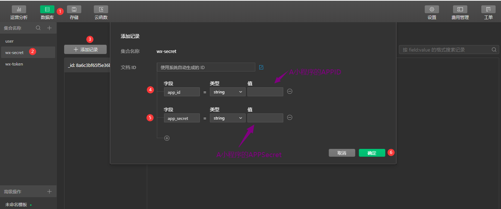

## 部署说明
---
### 下面小程序均简称为 A小程序和 B小程序
### 准备阶段
---
0. 都需要开通云开发哦！([不会开通云开发功能戳这里](./wxCloudDevelopment))
1. A小程序需要准备
    - APPID, APPSecret
    - 订阅消息ID ([订阅消息模板ID的选择](./wxSubscribeMessage.md))
    - 云开发环境ID
2. B小程序需要准备
    - APPID
    - 云开发环境ID


### Clone项目
---
1. clone 项目到本地
    ```
    git clone https://github.com/angxuejian/GOUTOU_PLUS.git
    ```
2. clone 成功后会看到 **GOUTOU_PLUS** 文件夹，进入文件夹后会有以下文件;
    > **gt_shop文件夹为用户端小程序代码**

    > **gt_manage文件夹为管理端小程序代码**

    

5. 恭喜哦！ 你已经拥有的全部源代码了。我们就先来部署 **gt_shop文件夹下的小程序代码**

### gt_shop文件夹 > A小程序部署
---
1. 将项目导入至微信开发工具中; 别忘了把 **APPID替换了哦** 要不然会提示你没有权限打开哦！

    

2. 在 **miniprogram > app.js** 中 替换 云开发环境id；默认为当前第一个环境 ([不知道云开发环境id，戳这里](./wxCloudDevelopment))

    

3. 在 **miniprogram > utils > config.js** 中 找到 **SUBSCRBE_ID变量** 替换 订阅消息模板 ID 和 腾讯地图key

     [腾讯地图API文档](https://lbs.qq.com/miniProgram/jsSdk/jsSdkGuide/jsSdkOverview) 

     [订阅消息模板ID的选择](./wxSubscribeMessage)

    

4. 部署**cloudfunctions目录下的**云函数
    - CloudAPIBase >> 统一请求操作数据库函数; 
    - CloudFile    >> 上传文件
    - CloudOrder   >> 订单支付, 退款, 查询
    - payCallback  >> 支付回调函数
    
    

    > 创建并部署完成后，打开云开发，查询是否成功,出现**已部署**则部署成功

    

5. 创建数据库集合; [数据库详情字段信息戳这里](./wxDatabaseInfo)
    - user               >> 用户表集合

    - user-address       >> 用户地址表集合
    - user-order         >> 用户订单表集合
    - user-shopping-cart >> 用户购物车表集合
    - shop-goods         >> 商品表集合
    - shop-goods-type    >> 商品分类表集合
    - shop-setting       >> 店铺设置

    

6. 开通云开发支付、退款功能和替换商户号
   
   开通云开发支付: [官方开通文档](https://developers.weixin.qq.com/miniprogram/dev/wxcloud/guide/wechatpay.html)
   

   替换商户号 **cloudfunctions > CloudOrder > configPay**

   

7. 完成？
    - 这时候 A小程序就已经全部部署完成了，保存后重新编译即可，但是打开之后应该是没有商品的，因为**shop-goods表中并没有数据**
        - 将 gt_manage小程序部署好，在gt_manage小程序中的**添加商品页面中**添加商品
        - **当前A，B小程序均使用程序内添加的数据，手动添加数据会出现意外错误哦**
        - **请使用程序 添加数据**

### gt_manage文件夹 > B小程序部署
----

1. 重复上文 **A小程序部署中的第1，第2条**  更改APPID，更改云环境ID; 还记得 **准备阶段的第2条吗？** 这是第二套的小程序APPID，云环境ID。不要和 **A小程序的一样哦**

2. 替换图片文件路径
    
    获取图片中的路径，并替换到 **miniprogram > utils > config.js**

    

    

3. 创建 **wx-secret数据库集合表**,  **wx-token数据库集合表**
    1. wx-secret >> A小程序的 APPID和APPSecret 表
        - 创建 wx-sectet 表之后，添加一条记录，如下图，如下表(_id会自动生成)

            key       | value               | type  
            ---       | ---                 | ---   
            app_id    | A小程序的APPID       | string
            app_secret| A小程序的 APPSecret  | string 
            
            
            
            
        - 添加记录成功, 取出 **_id**

    2. wx-token >> 请求A小程序的 access_token 表
        - 创建 wx-token 表之后，添加一条记录，如下图，如下表(_id会自动生成)
          
          key       | value| type  
          ---       | ---  | ---   
          token     | ""   | string

            > token 字段 为空即可, 之后代码会自动添加 token

            
            
            
        - 添加记录成功, 取出 **_id**

4. 替换 订阅模板消息，第 2 步 取出的 _id， A小程序的环境ID

    - 在 **gt_manage > cloudfunctions > CloudFunAPI > config.js 中** 替换以下字段
        key          | value
        ---          | ---  
        _ENV         | A小程序的环境 ID
        _ID          | 第 2 步 中 第 1 条 wx-secret 表中 取出的 _id
        _TID         | 第 2 步 中 第 2 条 wx-token 表中 取出的 _id
        _SUBSCRBE_ID | A小程序的 订阅模板消息 ID

        

5. 部署云函数与A小程序部署中的 第4条一样的方法部署; 
    - CloudAPIBase >> 统一请求操作数据库函数;
    - CloudFunAPI >> 统一操作A小程序的数据库函数(数据库, 订阅消息, 文件上传与下载)
    - CloudFile >> 上传文件
    - ImgCheck >> 校验图片安全性
    - getPhoneNumber >> 获取手机号
    > 云函数部署完成后 + 第1, 2, 3条 替换成功后，我们就可以**通过云函数操作A小程序中的数据库了**，这样就可以实现**管理**的作用了

6. 创建数据库集合与A小程序部署中的 第 5 条一样的方法创建； [数据库详情字段信息戳这里](./wxDatabaseInfo)
    - user >> 用户表

7. 完成？
    - 进行到这里，就已经B小程序就已经全部部署完成了，快去**添加商品**吧！


### 写的什么，完全看不懂
---
1. 算了，没完全看明白的，可以私聊，解惑

    - 邮箱： ydoghead@sina.cn 或 xuejian.ang@gmail.com

    - 微信： youbing_ang
    
    - QQ:   1251537708

> 无事不要骚扰哦
