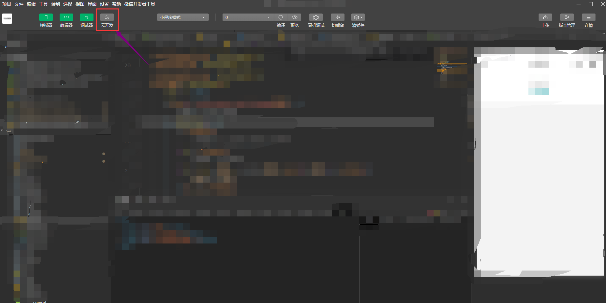
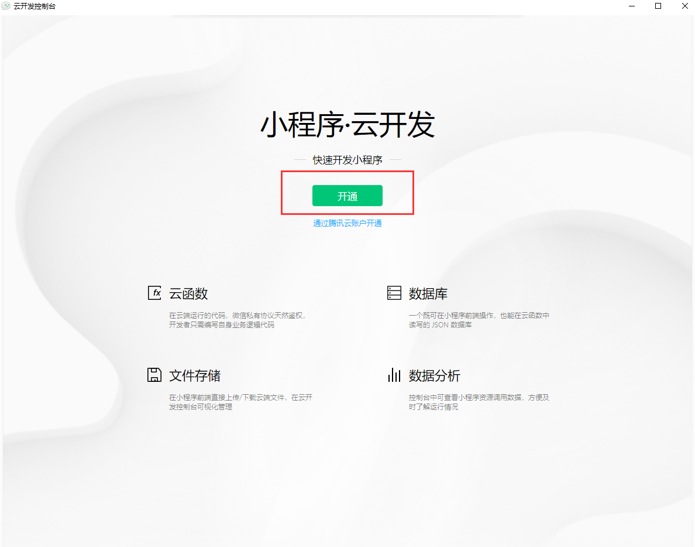
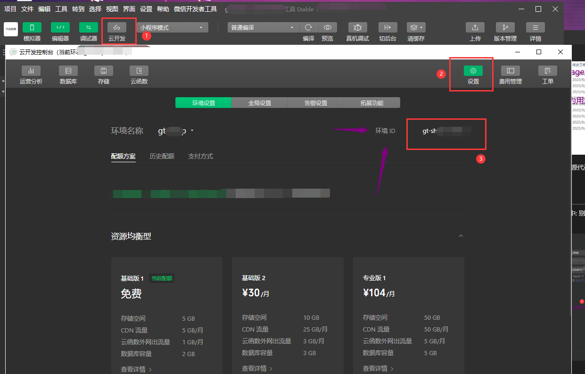
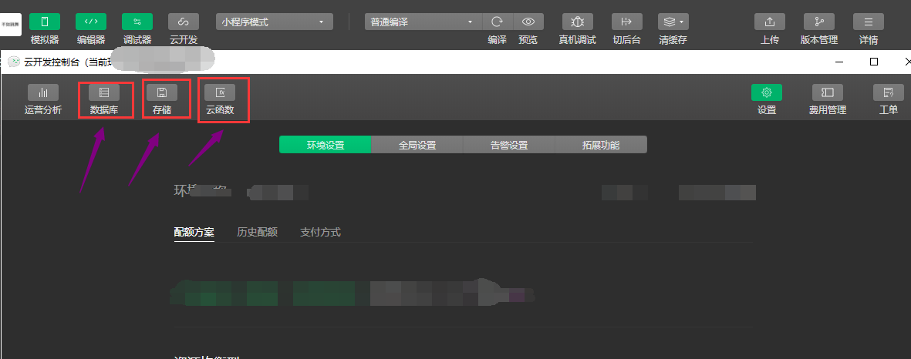

## 微信云开发
---
1. 进入小程序 **点击云开发** 按钮; (测试APPID是不可以点击的哦)

    

2. 点击后 会出现下面界面，**点击开通即可**; 开通需要30秒左右，等一会哦

    
3. 到这里，你已经开通云开发了哦！; 然后我们在设置中获取到 云开发的环境ID

    

4. 下面分别是云开发中的功能按钮 **数据库，存储，云函数**

    

> [云开发文档地址](https://developers.weixin.qq.com/miniprogram/dev/wxcloud/basis/getting-started.html)