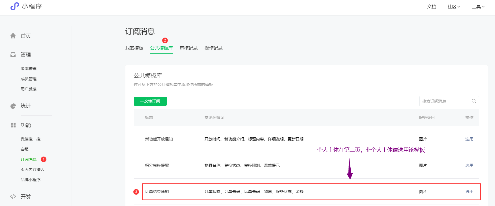
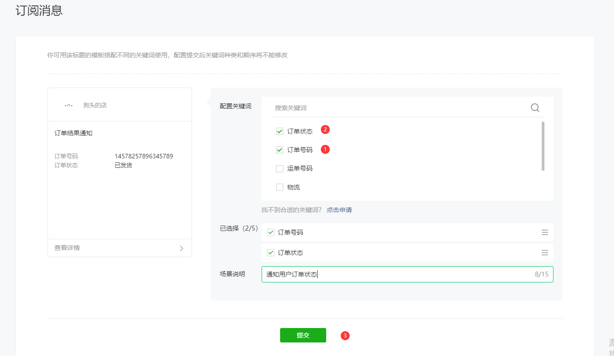
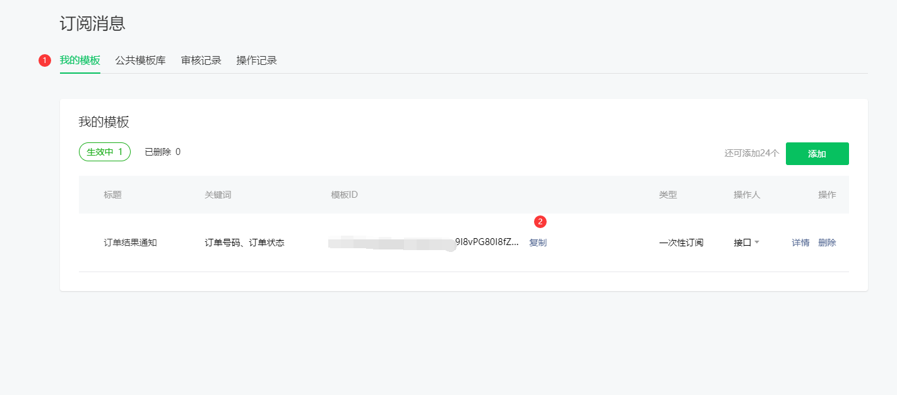
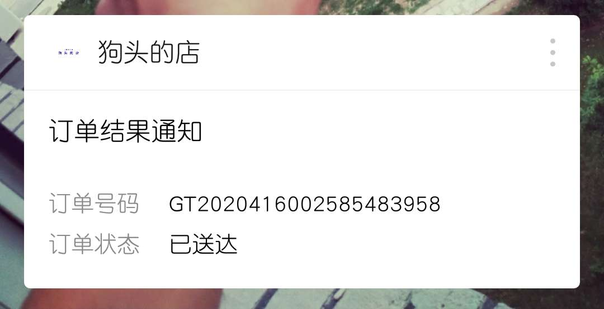

## 订阅消息模板
---

1. 进入小程序后台 -> 开通订阅消息 -> 选择公共模板消息(**请选择订单结果通知**模板消息)
    > 个人主体在 公共模板消息的 第二页会找到 订单结果通知

    > 非个人主体 请找到 并选择 订单结果通知 

    

2. 选用模板消息字段

    > 为保持统一，请先选择订单号码，再选择订单状态

    

3. 获取模板消息 ID

    

4. 最后呈现效果

    